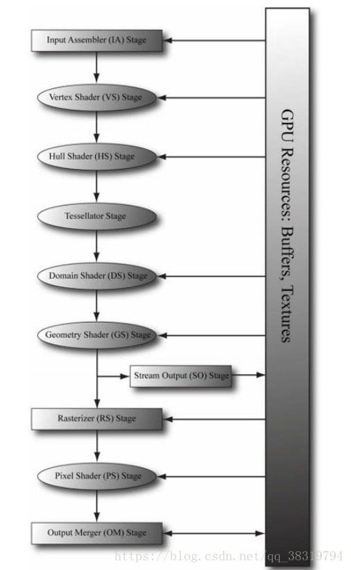

COM(Component Object Model)架构

C++编译器本质上被设计得更适合用源代码进行软件组件复用而非从二进制文件上经行软件组件复用，因为不同的编译器可能会期待并编译出组织结构不同的二进制文件，从而导致C++的二进制库(.lib和.dll文件)在不同编译器间可能无法通用。

为了解决这个问题微软提出了COM标准

COM中的每一个接口通过GUID（Global Unique Identifier）表示，客户通过COM工厂函数，传入GUID获得创建COM对象，获得指向该对象的指针，通过指针调用该对象的其他成员函数，这样就算COM对象的类实现发生了变化，但是客户依旧可以用COM接口创建COM对象

在COM中所有的接口都是IUnKnown接口。对于每一个COM对象，可以用AddRef()和Release()方法来增加或减少对于该对象的应用数(即指向该对象的指针数)，同时，每一个COM对象都维持者一个对象引用数，当调用AddRef时引用数加1，调用Release时引用数减1，当引用数为0时，COM会销毁该COM对象

IUnknown接口还有一个方法名为QueryInterface。该方法接收一个GUID和一个指向指针的指针作为参数，如果该GUID有效，那么该方法接受的指针将会接收GUID所指的接口实例

D3D11

D3D11的API基于COM设计。在D3D11中想要创建任何渲染系统对象都需要通过ID3D11Device对象，该对象负责为渲染系统的其它部分（对象）分配资源，IDXGISwapChain对象负责把渲染信息呈现到显示器上，ID3D11DeviceContext负责将渲染数据并入渲染管线并对渲染管线进行控制

渲染管线



想要渲染图形，就得先渲染三角形。渲染三角形需要的数据有三角形在三维空间的顶点信息(x, y, z)(存储在Vertex Buffer中)，每个顶点的索引信息(储存在index buffer中，决定那些顶点组成一个三角面和三角面的朝向),其中有些信息需要传导至shader中,使用GPU进行图形渲染,这时需要指定GPU读取输入信息的方式,即Input Layout


3D数学：

投影：

根据小孔成像的原理，光屏距离小孔越远，或者物体离小孔越近，在光屏上呈的像越大（如下图所示），


在计算机中，为了不使物体的投影翻转，我们可以假设，光屏在小孔的另一侧，保持Z方向上的固定距离Z'，物体与小孔的Z方向上的距离为变量Z，根据相似三角形原理，物体在光屏X轴、Y轴方向X‘，Y’上的投影位置应为物体在X轴、Y轴方向上的实际位置X、Y进行如下转换:										
$$
Y' = Y * Z' / Z
$$

$$
X'= X * Z'/Z
$$

在以下函数中Z‘被称为NearZ，Z被记为FarZ

通常我们希望投射空间中的顶点坐标，即经过以上处理的坐标，映射为NDC（normalize device coordinate），即X，Y，Z坐标映射到-1到1的范围内

对于一个顶点位置v = {x, y, z, 1},我们希望最终映射的NDC坐标v’
$$
 v' = (v * PerspectiveMatrix)/ z 
$$
其中v' = {x', y', z', 1},且x'，y‘随着ViewWidth/2和ViewHeight/2的增大而减小，随着NearZ的增大而增大（“光屏”的宽高越大，对应的FOV越大，x'，y'对应减小，NearZ越大，FOV越小）。对于z'来说,当z=NearZ时，z’ = 0；z = FarZ时，z‘ = 1；所以我们可以设PerspectiveMatrix【3】【3】 = a，  PerspectiveMatrix【3】【4】 = b，就可以得下式
$$
{a * NearZ + b = 0, a * FarZ + b = FarZ}
$$
由于最终的v‘结果还要将每个v坐标的元素除以z，因此第二个式子中的结果为FarZ

以下为伪代码

```C++
XMMatrix XMMatrixPerspectiveLH( 
	float ViewWidth, float ViewHeight, 
	float NearZ, float FarZ)
{
	return 
    {
        { 
            {2 * NearZ/ViewWidth, 0, 0, 0},
            {0, 2 * NearZ/ViewHeight, 0, 0},
            {0, 0, FarZ/FarZ-NearZ, 1},
            {0, 0, -NearZ*FarZ/(FarZ-NearZ), 0}
        }
    }
}
```

